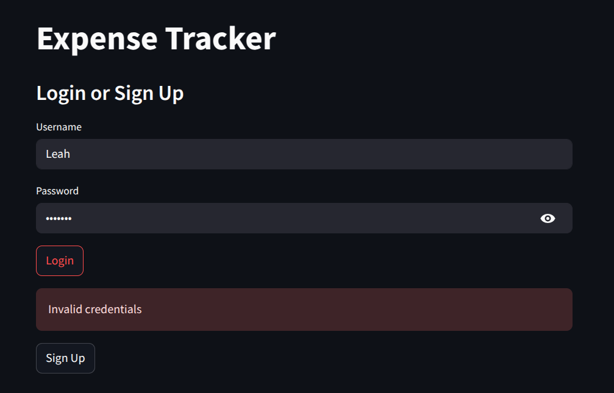
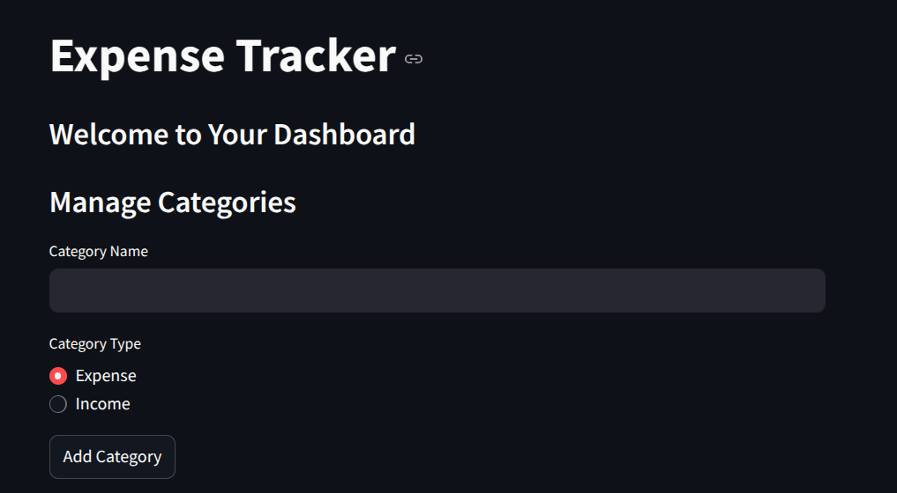
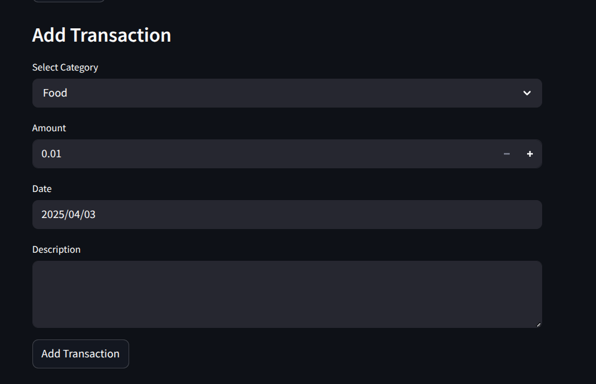
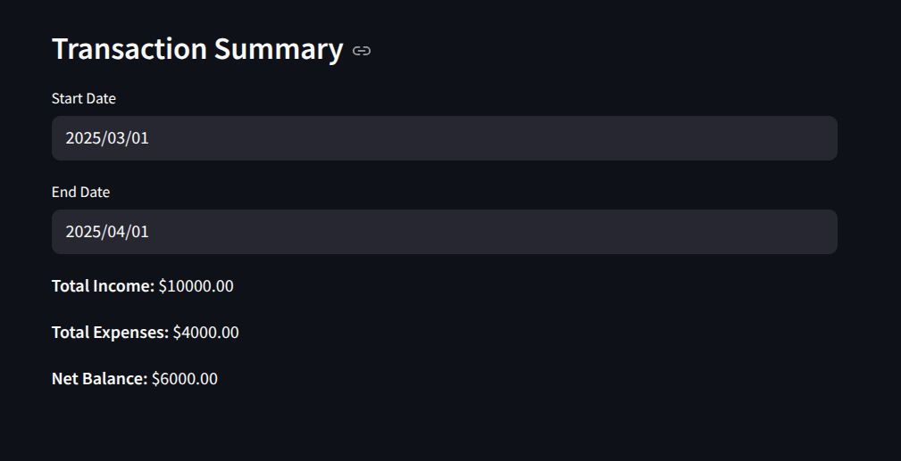

# Expense Tracker

## Introduction

This project is an Expense Tracker application developed as part of a Database Management Systems (DBMS) course. The application allows users to record, categorize, and analyze their financial transactions using a structured database. Built with **Streamlit** for the user interface and **SQLite** as the database, the system provides a seamless way to track income and expenses, manage categories, and view financial summaries over a selected time period.

The project demonstrates key database management concepts, including **user authentication, relational table design, CRUD operations, and data integrity enforcement** through foreign keys and constraints. Additionally, features such as soft deletion for categories, recurring transactions, and budget tracking enhance the application's functionality. By implementing these concepts, the project highlights the importance of efficient database design and query optimization in real-world applications.

## ER Design

### Introduction to ER Modeling
The Entity-Relationship (ER) model is a conceptual framework used to design and visualize the structure of a database system. It helps in defining the relationships between different entities and ensures data integrity. The ER diagram for this project illustrates the logical organization of users, transactions, budgets, recurring transactions, and categories. Each entity and relationship is carefully designed to support financial management operations efficiently.

### Entities and Relationships  

### 1. Users 
- **Attributes:** `username (PK)`, `password_hash`  
- **Description:** This entity stores user credentials and acts as the primary reference for all financial records.  
- **Relationships:**  
  - A user can create multiple **categories**, but each category belongs to only one user.  
  - A user can log multiple **transactions**, each associated with a category.  
  - A user can define multiple **budgets** linked to categories.  
  - A user can set **recurring transactions** for predefined intervals.  

### 2. Categories  
- **Attributes:** `name (PK)`, `user_id (PK, FK)`, `type (Income/Expense)`  
- **Description:** Represents the classification of transactions, either as "Income" or "Expense". Each category is user-specific.  
- **Relationships:**  
  - A user can have multiple categories.  
  - Each transaction belongs to a category.  
  - Budgets and recurring transactions are tied to categories.  

### 3. Transactions  
- **Attributes:** `id (PK, AutoIncrement)`, `user_id (FK)`, `category_name (FK)`, `amount`, `date`, `description`  
- **Description:** Stores financial transactions associated with a user and a category.  
- **Relationships:**  
  - Each transaction belongs to a user and a category.  
  - A transaction amount determines whether it is an expense or income.  

### 4. Budgets  
- **Attributes:** `id (PK, AutoIncrement)`, `user_id (FK)`, `category_name (FK)`, `amount`  
- **Description:** Represents the budget allocated to a category by a user.  
- **Relationships:**  
  - A user defines budgets for specific categories.  

### 5. Recurring Transactions  
- **Attributes:** `id (PK, AutoIncrement)`, `user_id (FK)`, `category_name (FK)`, `amount`, `interval`, `next_due_date`, `description`  
- **Description:** Represents transactions that occur at regular intervals (e.g., monthly salary, utility bills).  
- **Relationships:**  
  - A user sets recurring transactions under specific categories.  

## Justification of ER Design  
1. **Normalization:**  
   - The design ensures that each piece of data is stored in the most appropriate table, reducing redundancy and ensuring consistency.  
   - Users and categories are separate entities, preventing duplicate category entries for different users.  
   - Transactions reference categories, ensuring proper classification and reporting.  

2. **Referential Integrity:**  
   - Foreign keys enforce valid relationships between users, transactions, budgets, and categories.  
   - ON DELETE CASCADE ensures that when a user is deleted, their related data is automatically removed.  

3. **Scalability:**  
   - The structure allows for future enhancements, such as additional transaction types or new financial metrics.  
   - The database can accommodate a growing number of users and transactions without performance degradation.  

4. **Query Efficiency:**  
   - The design supports efficient querying of financial records by user and category.  
   - Indexing on primary keys ensures fast lookups for transactions and budgets.  

In conclusion, the ER diagram successfully models a structured and well-organized database that facilitates effective financial tracking. By following normalization principles and enforcing referential integrity, the system ensures data consistency, eliminates redundancy, and enhances overall efficiency.

### ER Diagram


## Database

The database for this Expense Tracker application is designed using **SQLite**, ensuring efficient data storage, integrity, and retrieval. The schema follows the principles of relational database design and is **normalized** to reduce data redundancy and maintain consistency.

### Normalization of the Database

Normalization is a database design process that structures tables to minimize redundancy and dependency. This project follows **Third Normal Form (3NF)** to ensure efficiency and data integrity. Below is an analysis of how the database adheres to different normal forms.


### Schema 

#### Tables
##### Users
```sql
CREATE TABLE users (
    username TEXT PRIMARY KEY,
    password_hash TEXT NOT NULL
);
```

##### Categories
```sql
CREATE TABLE categories (
    name TEXT,
    user_id TEXT,
    type TEXT CHECK(type IN ('Income', 'Expense')),
    PRIMARY KEY (name, user_id),
    FOREIGN KEY (user_id) REFERENCES users(username) ON DELETE CASCADE
);
```

##### Transactions
```sql
CREATE TABLE transactions (
    id INTEGER PRIMARY KEY AUTOINCREMENT,
    user_id TEXT,
    category_name TEXT,
    amount REAL NOT NULL,
    date TEXT NOT NULL,
    description TEXT,
    FOREIGN KEY (user_id) REFERENCES users(username) ON DELETE CASCADE,
    FOREIGN KEY (category_name, user_id) REFERENCES categories(name, user_id) ON DELETE CASCADE
);
```

##### Budgets
```sql
CREATE TABLE budgets (
    id INTEGER PRIMARY KEY AUTOINCREMENT,
    user_id TEXT,
    category_name TEXT,
    amount REAL NOT NULL,
    FOREIGN KEY (user_id) REFERENCES users(username) ON DELETE CASCADE,
    FOREIGN KEY (category_name, user_id) REFERENCES categories(name, user_id) ON DELETE CASCADE
);
```

##### Recurring Transactions
```sql
CREATE TABLE recurring_transactions (
    id INTEGER PRIMARY KEY AUTOINCREMENT,
    user_id TEXT,
    category_name TEXT,
    amount REAL NOT NULL,
    interval TEXT CHECK(interval IN ('Daily', 'Weekly', 'Monthly', 'Yearly')) NOT NULL,
    next_due_date TEXT NOT NULL,
    description TEXT,
    FOREIGN KEY (user_id) REFERENCES users(username) ON DELETE CASCADE,
    FOREIGN KEY (category_name, user_id) REFERENCES categories(name, user_id) ON DELETE CASCADE
);
```

#### First Normal Form (1NF)
1. **Atomicity of Data:** Each column in every table holds atomic values. For instance, the `users` table stores `username` and `password_hash` as separate attributes rather than combining them into one field.
2. **Uniqueness of Rows:** Each table has a **primary key** that uniquely identifies each record:
   - `users`: `username` (Primary Key)
   - `categories`: (`name`, `user_id`) (Composite Primary Key)
   - `transactions`: `id` (Primary Key)
   - `budgets`: `id` (Primary Key)
   - `recurring_transactions`: `id` (Primary Key)
3. **No Repeating Groups:** Data is structured so that every column holds a single type of value, avoiding repeating groups.

#### Second Normal Form (2NF)
To satisfy **2NF**, the schema eliminates **partial dependencies**, meaning that every non-key attribute depends entirely on the whole primary key:
1. In the `categories` table, the composite primary key (`name`, `user_id`) ensures that a category belongs to a specific user. No partial dependency exists because `type` (Income/Expense) fully depends on the primary key.
2. In the `transactions`, `budgets`, and `recurring_transactions` tables, all non-key attributes are fully dependent on the **primary key** (`id`).

#### Third Normal Form (3NF)
To satisfy **3NF**, the schema eliminates **transitive dependencies**, ensuring that all attributes depend directly on the primary key:
1. In `transactions`, `budgets`, and `recurring_transactions`, the `category_name` column references `categories(name, user_id)`. This ensures that each transaction is associated with a valid category, preventing orphaned records.
2. The **password_hash** column in `users` directly depends on `username`, without relying on any other attribute.

### Justification for Normalization
Normalization brings several advantages to this database:
1. **Data Integrity:** Foreign keys enforce relationships between tables, preventing orphaned data.
2. **Redundancy Reduction:** The schema avoids unnecessary duplication of data, optimizing storage.
3. **Consistency:** Since data is stored in separate tables with well-defined relationships, updates and deletions do not cause inconsistencies.
4. **Scalability:** A well-normalized database can handle more users, transactions, and categories efficiently.
5. **Security:** The normalization process supports best practices, such as hashing passwords and ensuring category ownership through composite keys.

In conclusion, this database schema is structured to maintain efficiency, consistency, and integrity while adhering to **Third Normal Form (3NF)**. The relational model ensures that the system can handle financial transactions, enforce category ownership, and maintain data accuracy while minimizing redundancy. The use of **foreign keys, composite keys, and constraints** strengthens data security and reliability, making the system robust for real-world usage.


## Modules of the Application

The application is structured into several functional modules that work together to provide an efficient personal finance management system. Each module is responsible for handling specific features, ensuring modularity, maintainability, and scalability. Below is a detailed breakdown of the core modules:

### 1. User Authentication Module  
#### Purpose:  
- Manages user registration and login functionalities.  
- Ensures secure authentication using password hashing.  

#### Key Features:  
- New users can create an account by providing a unique username and password.  
- Passwords are securely hashed before storage.  
- Users can log in with valid credentials to access their financial data.  

### 2. Category Management Module  
#### Purpose:  
- Allows users to define and manage categories for transactions.  
- Categories are classified as either **Income** or **Expense**.  

#### Key Features:  
- Users can create, update, and delete categories.  
- Categories are user-specific to prevent conflicts between multiple users.  
- Deleted categories are marked as inactive instead of being removed, ensuring data integrity.  

### 3. Transaction Management Module  
#### Purpose:  
- Handles the recording, updating, and deletion of financial transactions.  
- Categorizes transactions under predefined income and expense categories.  

#### Key Features:  
- Users can add transactions with details such as amount, date, description, and category.  
- Transactions can be filtered by date range to view financial history.  
- Secure handling of foreign key constraints ensures data consistency.  

### 4. Budgeting Module  
#### Purpose:  
- Allows users to set spending limits for specific categories.  
- Helps track financial goals by comparing actual expenses with budgets.  

#### Key Features:
- Users can allocate budgets to different expense categories.  
- The system warns users if they exceed their budget for a category.  
- Budgets are persistent and can be updated or deleted as needed.  

### 5. Recurring Transactions Module  
#### Purpose:  
- Manages financial transactions that occur at fixed intervals.  
- Automates tracking of recurring income and expenses.  

#### Key Features:  
- Supports transaction intervals such as **daily, weekly, monthly, and yearly**.  
- Automatically schedules recurring transactions based on their due date.  
- Users can edit or delete scheduled recurring transactions.  

### 6. Transaction Summary & Analytics Module  
#### Purpose:  
- Provides a breakdown of earnings and spending over a selected period.  
- Displays financial insights to help users manage their money effectively.  

#### Key Features:  
- Users can select a start and end date to view total income and expenses.  
- Expenses are grouped by category for better visualization.  
- The system provides an overall summary of financial activity within a period.  

### 7. Database Management Module  
#### Purpose:  
- Handles all database operations, including queries, inserts, updates, and deletions.  
- Ensures data consistency through proper foreign key relationships.  

#### Key Features:  
- Uses SQLite as the database backend for lightweight and efficient storage.  
- Implements database normalization to eliminate redundancy.  
- Ensures secure transactions with referential integrity constraints.  

In conclusion, each module in the application plays a crucial role in delivering a robust personal finance management system. The modular approach allows for easy maintenance, scalability, and future feature enhancements. 

## Steps to Connect the Database  

The application uses **SQLite** as its database backend to store and manage financial data. Below are the steps involved in connecting to the database and performing operations.

### 1. Import Required Libraries  
Before interacting with the database, we need to import the necessary libraries in Python:  

```python
import sqlite3
```
The `sqlite3` module is built into Python and allows us to connect and execute SQL queries on an SQLite database.

### 2. Establish a Connection to the Database  
To interact with the database, we first establish a connection using `sqlite3.connect()`:

```python
conn = sqlite3.connect("finance.db")
cursor = conn.cursor()
```
- `"finance.db"` is the name of the SQLite database file. If the file does not exist, SQLite automatically creates it.  
- The `cursor` object is used to execute SQL commands.  

If you want to ensure that the connection remains open while handling multiple requests, use **a context manager**:

```python
with sqlite3.connect("finance.db") as conn:
    cursor = conn.cursor()
```

### 3. Create Tables (If They Do Not Exist)  
Once connected, we define the database schema and create tables if they don’t already exist. This ensures that required tables are available for storing user data.

### 4. Insert Data into the Database  
To add data, we use parameterized queries to prevent SQL injection.

```python
cursor.execute("""
INSERT INTO users (username, password_hash) VALUES (?, ?)
""", ("john_doe", "hashed_password123"))

conn.commit()  # Save changes
```
- **`?` placeholders** prevent SQL injection.
- The values are passed as a tuple in the second argument.

### 5. Retrieve Data from the Database  
Fetching data allows us to display stored transactions, categories, and budgets.

```python
cursor.execute("SELECT * FROM transactions WHERE user_id = ?", ("john_doe",))
transactions = cursor.fetchall()

for txn in transactions:
    print(txn)  # Prints each transaction
```
- The `fetchall()` method retrieves all matching records.
- A loop is used to display each transaction.

### 6. Update Records in the Database  
Updating existing records is done using the `UPDATE` statement.

```python
cursor.execute("""
UPDATE transactions
SET amount = ?
WHERE id = ? AND user_id = ?
""", (50.00, 1, "john_doe"))

conn.commit()
```
This modifies the amount for a transaction with `id = 1` for the user **john_doe**.

### 7. Delete Records from the Database  
To remove data, we use the `DELETE` statement.

```python
cursor.execute("DELETE FROM transactions WHERE id = ?", (1,))
conn.commit()
```
This deletes the transaction with `id = 1`.

### 8. Close the Connection  
After executing operations, we close the connection to free up resources.

```python
conn.close()
```
If we used `with sqlite3.connect()`, the connection closes automatically.
<br><br>
Following these steps ensures a **secure, efficient, and well-structured** connection to the database. By following best practices such as using **parameterized queries, foreign keys, and proper indexing**, the system remains robust and scalable. 


## Output Screenshots










## [Sample code](https://github.com/leahtara/DBMS-Expense-Tracker-Streamlit.git)

## Conclusion  

This project successfully implements a **personal finance management system** using **SQLite** as the database backend. The application allows users to manage their transactions, categorize expenses and income, set budgets, and track recurring transactions. The use of **Streamlit** for the frontend ensures an intuitive and interactive user experience.  

The database design follows **normalization principles**, ensuring **data integrity, minimal redundancy, and efficient retrieval of financial records**. Each table is structured with appropriate **primary and foreign keys**, maintaining relationships between users, categories, transactions, budgets, and recurring transactions.  

By implementing features such as **category-based transaction tracking, budget management, and date-based spending summaries**, the application provides users with detailed insights into their financial habits. The inclusion of **soft deletion for categories** ensures data consistency while allowing flexibility in modifying financial categories.  

Overall, this project demonstrates the **importance of database design and management in real-world applications**. It showcases how **SQL operations, proper schema structuring, and application-layer logic** come together to build a functional and scalable financial management system. Future improvements could include **multi-user authentication, data visualization, and integration with external financial APIs** for a more comprehensive financial tracking experience.

